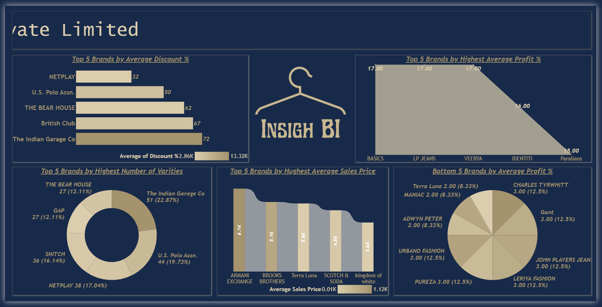

# Men’s Collection Project

This project showcases an end-to-end data pipeline and interactive BI dashboard for analyzing a men’s fashion collection. The pipeline integrates MySQL, Power Query, and Power BI to clean, transform, and visualize retail data, providing insights into discounts, profit margins, and brand performance.

---

## Resources

* Dashboard Link: [View on Power BI](https://app.powerbi.com/groups/c90382ef-3013-47d1-a8b0-cbe896ff6ca1/reports/37592d71-7786-42c8-9102-9f2dc5bcc62d/e0c5e9f4e55a86058009?experience=power-bi)
* Dataset Link: [Download Dataset](https://drive.google.com/file/d/1Hj_wxjFD2ZVkZZsiZNZXhBLgKEwbfad4/view?usp=drive_link)

---

## Problem Statement

Retailers and fashion brands often struggle to balance discounting strategies, profit margins, and product variety. Without clear insights, decision-making on pricing, brand positioning, and sales strategies becomes challenging.

This project addresses the problem by:

* Cleaning and preparing raw sales and pricing data.
* Creating calculated measures (discount %, profit %, cost price).
* Building a Power BI dashboard that highlights top and bottom brands by sales, discounts, profit, and variety.

---

## Steps Taken

1. **Database Setup**

   * Created a new MySQL database: `Men`.
   * Imported men’s T-shirt sales data into the database.

2. **Data Cleaning (SQL & Power Query)**

   * Removed unwanted characters (`?`) from `Original_Price` and `Sale_Price` using SQL scripts.
   * Further cleaned and standardized data inside Power Query Editor.

3. **Feature Engineering**

   * Added a Factor column:

     * If `Original_Price = NA` → `1.5`
     * Else → `0`.
   * Created calculated columns:

     * Sales*Factor = `[Sales_Price] * [Factor]`
     * Marked Price = If `Original_Price = NA` then `Sales*Factor` else `Original_Price`.
   * Converted fields into decimal type.
   * Dropped intermediate columns (`Factor`, `Sales*Factor`, `Original_Price`).

4. **DAX Calculations in Power BI**

   * Discount % = `(Marked Price – Sales Price) ÷ Marked Price * 100`
   * Profit % = `RANDBETWEEN(2,17)`
   * Cost Price = `(100 * Sales Price) ÷ (100 + Profit %)`.

5. **Visualization**

   * Page 1: Men’s fashion brand overview with scroller.
   * Page 2: Analytical dashboard with top and bottom 5 brand comparisons.

---

## Dashboard Insights

### Page 1: Men’s Collection Brand Overview

* Provides a showcase of available men’s fashion brands.
* Includes a scroller for better discoverability.

---

### Page 2: Detailed Analytical Dashboard

**Top 5 by Average Discount %**

* Highest discounts: The Indian Garage Co (72%), British Club (67%), The Bear House (62%).

**Top 5 by Highest Profit %**

* LP Jeans, VEERYA, and IDENTITI achieve profit margins up to 17%.

**Top 5 by Variety**

* The Indian Garage Co (51 varieties) and U.S. Polo Assn. (44 varieties) lead in diversity.

**Top 5 by Highest Sales Price**

* Armani Exchange and Brooks Brothers dominate premium pricing, with averages above 5K.

**Bottom 5 by Profit %**

* Terra Luna, MANIAC, and ADWYN PETER struggle with low margins (≈8–12%).

---

## Key Learnings

* High discounts do not always translate to high profitability.
* Luxury brands maintain strong pricing power even with limited variety.
* Mid-tier brands balance variety, discounting, and profitability effectively.

---

## Insights & Recommendations

1. **Optimize Discount Strategy**

   * Brands with extremely high discounts (e.g., 70%+) risk eroding profitability. They should consider reducing discount depth while maintaining volume.

2. **Leverage Premium Positioning**

   * Luxury brands like Armani Exchange prove that customers pay for exclusivity. Mid-tier brands could introduce premium sub-lines with limited editions to capture similar margins.

3. **Expand Variety in Strong Brands**

   * Brands with proven demand (e.g., The Indian Garage Co, U.S. Polo Assn.) should further expand their collections to maximize market share.

4. **Support Underperforming Brands**

   * Brands with low profitability should re-evaluate supply chain costs, renegotiate sourcing, or adjust pricing to recover margins.

5. **Data-Driven Monitoring**

   * Continue using dashboards to track profitability, discount efficiency, and variety distribution. Apply regular updates for trend-based decision-making.

---

## Tools & Technologies

* MySQL → Data storage and cleaning
* SQL → Price corrections
* Power BI → Data modeling, transformations, dashboards
* DAX → Calculated fields for profitability and discount analysis

